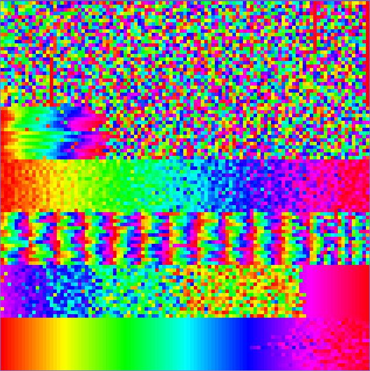

# Rainbow Sorting

Colorful way to visualize various sorting algorithms in Processing.py.

## Implemented algorithms

1. Bubble sort
2. Shaker sort
3. Insertion sort
4. Shell sort
5. Merge sort
6. Heap sort
7. Quick sort

## Installation

Dependencies: `java >= 1.8`, older versions may also work.

**Linux** and **Mac**:

```bash
git clone https://github.com/ly0va/rainbow-sorting.git
cd rainbow-sorting
./install.sh              # downloads processing-py.jar
```

For **Windows**, you should run it using [Processing IDE](https://processing.org/download/).

## Usage

Run with

```bash
java -jar processing-py.jar sorting.pyde
```

## Demo

Watch demo here: https://imgur.com/gallery/zurNLYf


